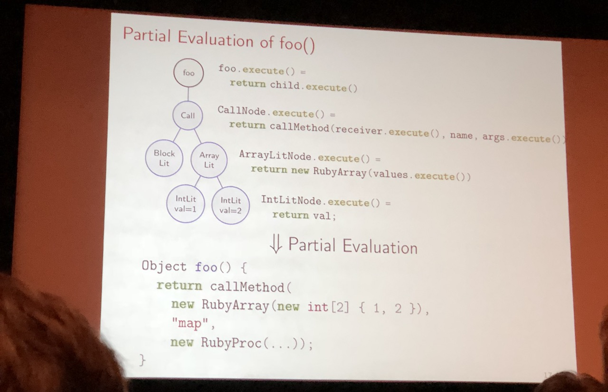
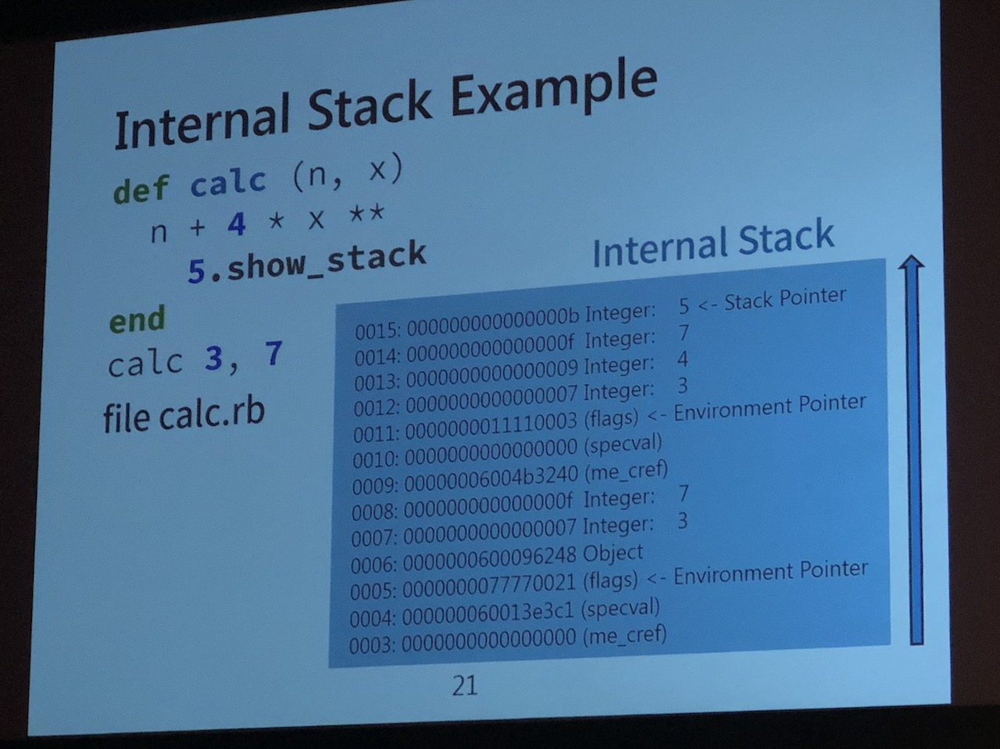
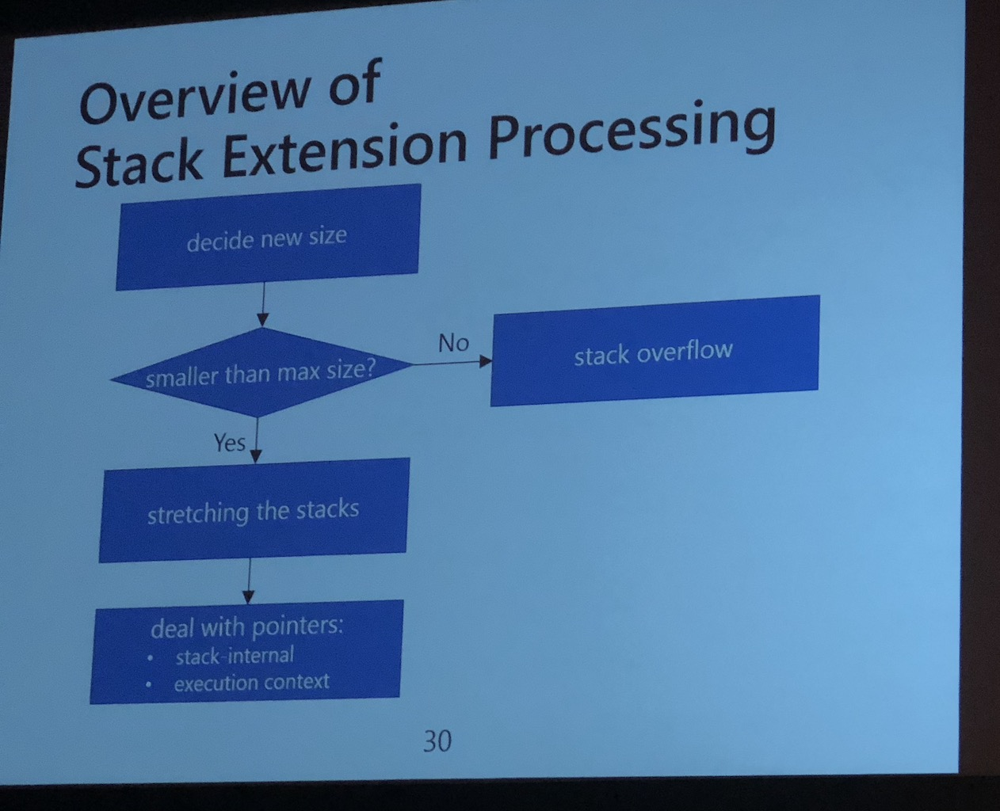
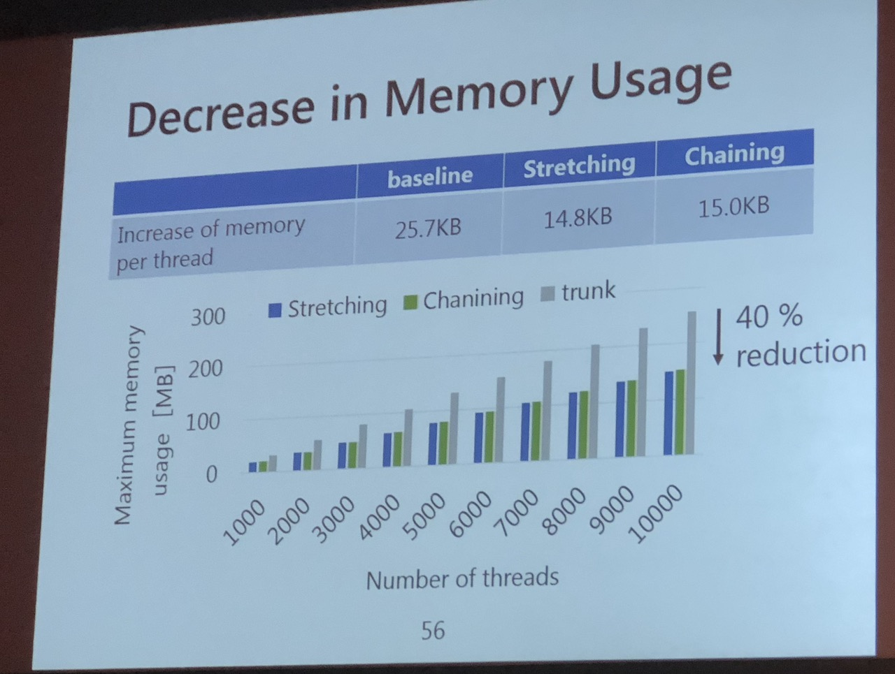

# Day 3:

## Benoit Daloze - "Parallel and Thread-Safe Ruby at High-Speed with TruffleRuby" (Keynote)

### Notes

TruffleRuby has two startup modes: either on JVM or on SubstrateVM which compiles Ruby to native executable. 

With Ruby 3x3 comming up there is a plan to make CRuby 3.0 3 times faster that 2.0, but do we have to wait until 3.0 (until at least 2020)? And should we only aim for 3x speedup?

[Demo of running OptCarrot with CRuby and TruffleRuby]

TruffleRuby already achieves close to 5x faster CPU performance than CRuby. Apart from CPU intensive tasks, TruffleRuby is also much faster at tasks like rendering ERB templates due to more performant String implementation. But it's still in early stages, so running big projects like Discourse is still a challenge. There are a lot of dependencies and many C extensions which need manual patching.

TruffleRuby achieves such speedup with Partial Evaluation and Graal JIT Compiler. 

Partial Evaluation speeds up a method execution chain by inlining methods, blocks and constant expressions thus simplifying the AST. Another thing that is done under the hood is optimizing data types usage. For example, while iterating you don't necesairly have to use ruby array, it can be changed to native jvm array which will be faster. Since we compile the code it's possible to perform even more optimizations like constant folding.

On the other hand we have different approach in CRuby and MJIT. It uses Ruby bytecode to create C libraries of methods that are used most often and use those libraries instead of Ruby version. But MJIT doesn't have access to Ruby binary so it cannot optimize calls to internal methods. We should focus on expanding JIT with a way to understant native Ruby methods so it can use this for further optimization.

The next part of the talk will be about Parallel and Thread-Safe Ruby. Dynamic languages tend to have poor support for parallelism, because of their implementation. Both CRuby and CPython have GIL which makes it impossible to execute parallel code in a single process. Solutions like JRuby or Rubinus have unsafe calls, so things like using `Array#<<` concurrently raises an exception.

Those problems are being slowly tackled by Guilds. It focuses on better memory model with almost no shared memory and no low level data races. But it would require many libraries to be rewritten, as it uses different approach than Ruby Threads.

If we try to concurrently append to an array we won't get problems in CRuby (but no real parallelism as well). Doing this with JRuby or Rubinus would require us to create a mutex, but it adds a significant overhead. Since Arrays are thread-safe in CRuby people assume that they will behave the same in other implementations, which leads to a lot of errors.

That's actually a hard problem. How do we make a collection thread-safe but don't add overhead for single-threaded operations? In dynamic languages there is a similar problem regarding objects. All objects' fields are basically a collection that can be modified at any given time. 

The idea for solving this is to only wynchronize objects that can be accesed by multiple threads. If something is used in a single thread only there is no need to add synchronization mechanism.

### Takeaways

TruffleRuby runs unmodified Ruby code faster. It also supports safe parallel execution (safe arrays will be available in a few months). It also supports Ruby Threads so there is no need to rewrite any piece of your code.

It shows that we can achieve high performance for Ruby with parallelism and no single-threaded overhead.

Try out TruffleRuby by installing it with your ruby manager of choice. 

### Q&A

1. Q: The setup time for TruffleRuby is but. Are there any plans to improve startup performance?

   A: We want to improve on this and there are some works already in progress. Loading code is indeed slower than it should be and improving this will be the next step.

2. Q: Is Partial Evaluation done by you or is there some framework for this?

   A: This is similar approach to what has been used for JavaScript. Actually AST interpreter doesn't care about the language.

3. Q: How does the memory usage differ between the implementations?

   A: SubstrateVM has bettter memory usage than JVM version.

## Keita Sugiyama, Martin J. Dürst - "Grow and Shrink - Dynamically Extending the Ruby VM Stack"

### Intro

Contributions regarding Unicode for Ruby

### Notes

There are more and more cores available in modern CPUs, but Ruby is still struggling with multi-threading. Each Ruby VM thread needs it's own stack. They are fixed in size to 1MB in order to avoid stack overflow. But the more threads you have the more memory you'll need just for those stacks.

Ruby VM actually uses two stacks. The first one is Call Stack which constains control frames (one per invocation). You'll be able to preview this stack with [feature #14801](https://bugs.ruby-lang.org/issues/14801). The other stack that is growing from the bottom is internal stack. It's used for executing instructions and there is one frame created per invocation.

The idea of Stack Extension was proposed by Koichi Sasada in 2016 and has been worked on since. When a potential stack overflow is detected we can double the stack size. 

Because the stacks move we'll have to take care of internal stack pointers as they will become invalid. Depending on pointer type we'll either adjust it's target or change the referencing method. For example for local variables we could change method from using direct pointers into using offset from start of stack. Conversion between pointer and offset is quite easy to perform.

There is one more problem with Ruby methods arguments. When passing them to C functions, they won't expect their position to change. We can tackle this by copying the values into a secure memory area.

While developing this feature there was a problem with debugging. Stack overflows happen too late and there is no access to the original stack. Instead of removing them we'll just mark them as unsused so we can preview them. The other problem is that stack extensions happened to rarely. The solution was to manually force stack extensions more frequently.

In the end all tests have passed, so it seems that there is a fully functioning implementation ready.

We can now check the impact on execution speed. On average the execution is 18% slower, possibly because we now use indirect access for call stack which requires more time. If we were able to keep call stack in the same place we could avoid the slowdown.

A new methodology was proposed. Instead of stretching we could use chaining (inspired by Lua's implementation). With chaining there is average of only 6% slowdown. Chaining is slower because we still have to move internal stack and copy arguments to C functions.

With dynamic stack size we could now change the initial stack size. It has almost no influence on execution speed but helps keep memory usage lower. In current implementation the initial stack size has been lowered from 1MB to 1KB. This allowed 40% reduction of memory usage. And it seems that the smaller the initial size, the greater the memory saving can be achieved.

But as it turns out, memory usage during tests was much lower than expected. With 10k threads and 1MB stack size we'll expect 10GB memory usage, but it was close to 250MB. (why? It was explained on the slides but they were changing too fast) 

We have to keep in mind that ruby memory is managed in four layers. Apart from Ruby VM layer that we're considering, there is also allocator (things like glib malloc), operating system (virtual memory) and hardware layer (caching etc).

### Q&A

1. Q: What methods exist for possible speed improvements?

   A: In current implementation the control frame is implemented one by one which is not good. We may also reduce number of time the stack is converted

2. Q: There are two stacks growing from top and bottom. You chain the top one, ist there room for chaining in the bottom one?

   A: When the argument is placed in memody the stack frame must extend. If you do that the internal stack must move and it's not effective.

3. Q: Call stack had become the the linked list. Ist this bi-directional?

   A: Yes, we're using bi-directional linked list. But we should actually be able to change it into single-directional one.

